```mermaid
erDiagram
  %% User Table
  User {
    id integer PK
    email character
    username character
    password_hash character
    status user_status
    first_name character
    last_name character
    avatar_url character
    bio character
    timezone character
    locale character
    notification_preferences json
    mfa_enabled boolean
    mfa_secret character
    last_login timestamp
    failed_login_attempts integer
    locked_until timestamp
    created_at timestamp
    updated_at timestamp
    deleted_at timestamp
  }

  %% Security Tables
  security_audit_logs {
    id integer PK
    timestamp timestamp
    event_type security_event_type
    user_id integer FK
    ip_address character
    user_agent character
    request_path character
    request_method character
    details json
    expires_at timestamp
  }

  security_events {
    id integer PK
    user_id integer FK
    action security_action
    timestamp timestamp
    event_type security_event_type
    ip_address character
    severity security_severity
    description character
    event_metadata json
    expires_at timestamp
  }

  sessions {
    id integer PK
    user_id integer FK
    session_token character
    device_info json
    ip_address character
    user_agent character
    created_at timestamp
    expires_at timestamp
    last_activity timestamp
  }

  %% Subscription/Payment Tables
  SubscriptionPlan {
    id integer PK
    name character
    price float
    features json
    created_at timestamp
    updated_at timestamp
  }

  Subscription {
    id integer PK
    user_id integer FK
    plan_id integer FK
    status subscription_status
    started_at timestamp
    expires_at timestamp
    created_at timestamp
    updated_at timestamp
  }

  Payment {
    id integer PK
    subscription_id integer FK
    amount float
    payment_method payment_method_type
    payment_date timestamp
    status payment_status
    transaction_id character
  }

  %% Organization/Project Tables
  Organization {
    id integer PK
    name character
    description text
    created_at timestamp
    updated_at timestamp
  }

  projects {
    id integer PK
    organization_id integer FK
    name character
    description text
    created_at timestamp
    updated_at timestamp
  }


  rag_queries {
    id integer PK
    user_id integer FK
    query_text text
    context json
    response text
    sources json
    timestamp timestamp
  }

  %% AI Agent Tables
  agent_actions {
    id integer PK
    agent_type agent_type
    user_id integer FK
    request_id integer
    action_data json
    result json
    status agent_status
    error_message text
    timestamp timestamp
  }

  agent_feedback {
    id integer PK
    agent_action_id integer FK
    user_id integer FK
    feedback_score integer
    feedback_text text
    timestamp timestamp
  }


  

  task_attachments {
    id integer PK
    task_id integer FK
    file_name character
    file_path character
    file_type character
    file_size integer
    uploaded_by integer FK
    created_at timestamp
    updated_at timestamp
  }

  task_comments {
    id integer PK
    task_id integer FK
    user_id integer FK
    content text
    parent_id integer FK
    created_at timestamp
    updated_at timestamp
  }

  task_history {
    id integer PK
    task_id integer FK
    user_id integer FK
    action task_action
    field character
    old_value character
    new_value character
    created_at timestamp
  }

  task_categories {
    id integer PK
    name character
    description character
    color_code character
    icon character
    parent_id integer FK
    created_at timestamp
    updated_at timestamp
  }

  %% Emotional Intelligence Table
  emotional_intelligence_logs {
    id integer PK
    user_id integer FK
    emotion emotion_source
    confidence_score double
    source emotion_source
    timestamp timestamp
    expires_at timestamp
  }

  %% Productivity Modeling Table
  productivity_patterns {
    id integer PK
    user_id integer FK
    task_type task_type
    optimal_time timestamp
    energy_level double
    timestamp timestamp
  }

  %% Ambient Intelligence Table
  ambient_intelligence_logs {
    id integer PK
    user_id integer FK
    event_type event_type
    noise_level double
    timestamp timestamp
  }

  %% AI Models Table
  ai_models {
    id integer PK
    name character
    version character
    type model_type
    storage_path character
    model_metadata json
    status model_status
    created_at timestamp
    updated_at timestamp
  }

  %% Feedback System
  feedback {
    id integer PK
    user_id integer FK
    type feedback_type
    title character
    content text
    status feedback_status
    priority feedback_priority
    category feedback_category
    context json
    resolution text
    resolved_by integer FK
    resolved_at timestamp
    created_at timestamp
    updated_at timestamp
  }

  feedback_tags {
    feedback_id integer PK, FK
    tag_id integer PK, FK
    created_at timestamp
  }

  %% Tag System
  tags {
    id integer PK
    name character
    type tag_type
    color character
    created_at timestamp
    updated_at timestamp
  }

  %% System Logs
  system_logs {
    id integer PK
    level log_level
    category log_category
    message text
    details json
    source character
    trace_id character
    user_id integer FK
    created_at timestamp
    expires_at timestamp
  }

  %% User Preferences
  user_preferences {
    id integer PK
    user_id integer FK
    theme theme_type
    language character
    timezone character
    date_format character
    time_format character
    notifications_enabled boolean
    accessibility_settings json
    created_at timestamp
    updated_at timestamp
  }

  %% Roles/Permissions
  roles {
    id integer PK
    name character
    description text
    created_at timestamp
    updated_at timestamp
  }

  permissions {
    id integer PK
    name character
    description text
    resource character
    action character
  }

  role_permissions {
    role_id integer PK, FK
    permission_id integer PK, FK
    created_at timestamp
  }

  user_roles {
    user_id integer PK, FK
    role_id integer PK, FK
    created_at timestamp
  }

  %% Workflows
  workflows {
    id integer PK
    name character
    description text
    category workflow_category
    status workflow_status
    version character
    settings json
    triggers json
    permissions json
    created_by integer FK
    created_at timestamp
    updated_at timestamp
    published_at timestamp
    archived_at timestamp
  }

  workflow_steps {
    id integer PK
    workflow_id integer FK
    name character
    description text
    step_type step_type
    order integer
    config json
    conditions json
    timeout integer
    retry_config json
    is_required boolean
    auto_advance boolean
    can_revert boolean
    created_at timestamp
    updated_at timestamp
  }

  workflow_transitions {
    id integer PK
    from_step_id integer FK
    to_step_id integer FK
    conditions json
    triggers json
    created_at timestamp
  }

  workflow_executions {
    id integer PK
    workflow_id integer FK
    status execution_status
    start_time timestamp
    end_time timestamp
    error_log text
    performance_metrics json
  }

  workflow_agent_links {
    workflow_id integer PK, FK
    agent_type varchar PK
    config json
  }

  %% Enhanced Context Tracking
  context_snapshots {
    id integer PK
    user_id integer FK
    multimodal_data json
    derived_context json
    timestamp timestamp
  }

  knowledge_base {
    id integer PK
    content text
    embeddings vector(1536)
    source_url varchar
    entity_name varchar
    relationships json
    user_id integer FK
    last_accessed timestamp
    created_at timestamp
    updated_at timestamp
  }

  %% Enhanced Tasks Table
  tasks {
    id integer PK
    title varchar(255)
    description text
    user_id integer FK
    assignee_id integer FK
    status task_status
    priority task_priority
    category_id integer FK
    workflow_id integer FK
    organization_id integer FK
    creator_id integer FK
    predicted_task_id integer FK
    workflow_execution_id integer FK
    context_snapshot_id integer FK
    due_date timestamp
    created_at timestamp
    updated_at timestamp
    completed_at timestamp
    confidence_score double
  }

  %% Added Audit Trails
  workflow_agent_links_history {
    id integer PK
    workflow_id integer FK
    agent_type agent_type
    config json
    action change_action
    changed_by integer FK
    changed_at timestamp
  }

  context_snapshots_history {
    id integer PK
    context_snapshot_id integer FK
    multimodal_data json
    derived_context json
    action change_action
    changed_by integer FK
    changed_at timestamp
  }

  vector_database {
    id integer
    document_id integer
    embeddings vector(1536)
    metadata json
    last_accessed timestamp
  }

  collaboration_sessions {
    id integer PK
    workflow_id integer FK
    participants json
    session_data json
    created_at timestamp
  }

  workflow_versions {
    id integer PK
    workflow_id integer FK
    version integer
    snapshot json
    created_at timestamp
  }

  access_policies {
    id integer PK
    resource_type varchar
    resource_id integer
    policy_rules json
  }

  risk_assessments {
    id integer PK
    user_id integer FK
    risk_score double
    triggers json
  }

  vector_indexes {
    id integer PK
    index_type varchar
    config json
    last_rebuilt timestamp
  }

  data_lineage {
    id integer PK
    source_id integer
    source_type varchar
    operation varchar
    output_id integer
    timestamp timestamp
  }

  agent_types {
    type varchar PK
    description text
  }

  model_types {
    type varchar PK
    description text
  }
  
  task_statuses {
    status varchar PK
    description text
  }

  resource_types {
    type varchar PK
    description text
  }



  %% Relationships
  User ||--o{ rag_queries : "creates"
  User ||--o{ agent_actions : "triggers"
  User ||--o{ tasks : "creates"
  User ||--o{ emotional_intelligence_logs : "generates"
  User ||--o{ productivity_patterns : "generates"
  User ||--o{ ambient_intelligence_logs : "generates"
  User ||--o{ feedback : "provides"
  User ||--o{ user_preferences : "has"
  User ||--o{ security_audit_logs : "generates"
  User ||--o{ security_events : "triggers"
  User ||--o{ sessions : "has"

  %% Agent Relationships
  agent_actions ||--o{ agent_feedback : "receives"


  %% Task Relationships
  tasks ||--o{ task_attachments : "has"
  tasks ||--o{ task_comments : "has"
  tasks ||--o{ task_history : "tracks"
  tasks }o--|| task_categories : "belongs_to"
  tasks }o--|| Organization : "belongs_to"
  tasks ||--o{ task_anticipation_logs : "has_predictions"

  task_anticipation_logs ||--o{ User : "created_by"

  %% Roles/Permissions Relationships
  roles ||--o{ user_roles : "grants"
  permissions ||--o{ role_permissions : "assigned_to"
  user_roles }o--|| User : "belongs_to"
  role_permissions }o--|| roles : "belongs_to"

  %% Feedback Relationships
  feedback ||--o{ feedback_tags : "tagged_with"
  tags ||--o{ feedback_tags : "categorizes"

  %% Subscription Relationships
  SubscriptionPlan ||--o{ Subscription : "offers"
  Subscription ||--o{ Payment : "has"
  User ||--o{ Subscription : "subscribes_to"

  %% Organization/Project Relationships
  Organization ||--o{ projects : "manages"
  Organization ||--o{ User : "owned_by"
  projects ||--o{ tasks : "contains"
  projects ||--o{ workflows : "uses"

  %% AI Models Relationships
  ai_models ||--o{ agent_actions : "powers"

  %% Security Relationships
  security_audit_logs ||--|| sessions : "audits"
  sessions ||--o{ security_events : "records"

  %% Workflow Relationships
  workflows ||--o{ workflow_steps : "contains"
  workflows ||--o{ workflow_transitions : "defines"
  workflow_steps ||--o{ workflow_transitions : "connects"
  workflow_steps ||--o{ agent_actions : "triggers"

  workflows ||--o{ workflow_executions : "has"
  workflow_executions }o--|| context_snapshots : "uses"
  workflows ||--o{ workflow_agent_links : "configures"
  tasks }o--|| workflow_executions : "part_of"

  knowledge_base ||--o{ tasks : "supports"
  knowledge_base ||--o{ rag_queries : "references"
  knowledge_base ||--o{ agent_actions : "used_by"

  workflow_agent_links ||--o{ agent_actions : "triggers"


  workflows ||--o{ workflow_versions : "has"
  workflows ||--o{ collaboration_sessions : "supports"

  %% Connect vector infrastructure
  vector_database ||--o{ vector_indexes : "uses"
  knowledge_base ||--o{ vector_indexes : "indexes"

  %% Enhance AI governance
  ai_models ||--o{ data_lineage : "traces"
  ai_models }o--|| model_types : "of_type"
  model_types ||--o{ data_lineage : "used_in"
  tasks }o--|| task_statuses : "has_status"
  task_statuses ||--o{ task_history : "tracks_changes"
  agent_actions ||--o{ data_lineage : "traces"

  workflow_agent_links ||--|| agent_types : "of_type"
  agent_types ||--o{ agent_actions : "used_by"

  rag_documents ||--o{ vector_database : "has_embeddings"


  data_lineage ||--o{ tasks : "produces_output"

  workflow_agent_links ||--o{ workflow_agent_links_history : "has_history"
  workflow_agent_links_history ||--o{ User : "changed_by"
  context_snapshots ||--o{ context_snapshots_history : "has_history"

  collaboration_sessions ||--o{ User : "initiated_by"

  vector_indexes ||--o{ rag_queries : "supports"

  risk_assessments ||--o{ Organization : "owned_by"
  risk_assessments ||--o{ User : "assesses"

  access_policies }o--|| resource_types : "governs"
  access_policies ||--o{ Organization : "owned_by"


```

## 1\. Introduction

The **AI Workspace Assistant (AIWA)** is an advanced AI-powered platform designed to enhance productivity and efficiency in modern workspaces. AIWA integrates **Retrieval-Augmented Generation (RAG)**, **AI Agent Ecosystems**, **Computer Vision**, and **Natural Language Processing (NLP)** to automate repetitive tasks, provide intelligent suggestions, and create a seamless and personalized workspace experience.

## 2\. Program Architecture

### A. Core Engine

- Python-based backend
- Event handling system
- Plugin and settings management
- User profile system
- **Task Scheduling Engine**
- **Calendar Sync Manager**
- **RAG System Integration**
- **AI Agent Ecosystem**

### B. Input Processing Modules

#### 1\. Vision Module (Computer Vision)

- Camera input processing
- Gesture recognition
- Posture detection
- Face/emotion analysis
- Eye fatigue detection

#### 2\. Audio Module

- Voice command processing
- Ambient noise analysis
- Audio feedback system
- Stress level detection
- Enhanced NLP processing
- Meeting voice commands

#### 3\. System Monitor Module

- Keyboard/mouse usage tracking
- Application usage monitoring
- Screen time tracking
- RSI monitoring
- Focus mode tracking
- Productivity metrics collection

### C. Task & Calendar Management

#### 1\. Calendar Management

- Google Calendar/Outlook sync
- Custom calendar implementation
- Meeting scheduler
- Event analysis engine
- Preparation time calculator

#### 2\. Task Management

- Smart to-do list system
- Task prioritization engine
- Deadline tracking
- Smart rescheduling
- Project management integration
- **Proactive Task Anticipation**

### D. Productivity Module

- Focus mode controller
- Pomodoro timer system
- Distraction blocker
- Work session analytics
- Email fetcher & response reminder system
- Priority inbox management
- Summary generator & schedule optimizer
- **Personalized Productivity Modeling**

### E. Natural Language Understanding Module

#### 1\. Chatbot System

- Command interpreter
- Context management
- Response generator
- **RAG System Integration**

#### 2\. Query Processing

- Schedule query handler
- Task query processor
- Natural language parser

#### 3\. Pattern Recognition

- Event pattern analyzer
- Scheduling suggestion engine
- Habit detection system

### F. Device & File Management Module

- Smart search engine
- Voice-controlled file finder
- File categorization system
- Clipboard history tracker
- Smart paste assistant
- Voice-activated launcher & App shortcut manager

### G. Ambient & Emotional Intelligence

#### 1\. Ambient Intelligence

- Adjusts workspace settings based on meetings and noise levels
- Uses calendar integration, noise analysis, and contextual data

#### 2\. Emotional Intelligence Integration

- Detects stress or fatigue through voice and posture analysis
- Provides personalized suggestions for breaks or adjustments

### H. Workflow Orchestration Layer

- Workflow Designer UI
- Agent Action Library
- Execution Engine
- Context Monitor
- Error Handling System

### I. Unified Context Service

- Multimodal Data Fusion
- Real-Time Context Snapshotting
- Cross-Module Context Sharing
- Privacy-Preserving Aggregation

## 3\. Technology Stack

### A. Primary Technologies

- **Python** (Core backend)
- **OpenCV & MediaPipe** (Computer vision, gesture recognition)
- **TensorFlow/PyTorch** (ML models)
- **SQLite/PostgreSQL** (Data storage)
- **SpaCy/NLTK** (NLP processing)
- **Pinecone, LangChain** (RAG system)
- **AutoGen, CrewAI** (AI agent coordination)
- **GPT-4 Turbo, LLaMA-2** (Advanced AI models)

### B. Supporting Technologies

- **JavaScript/Electron** (GUI)
- **Node.js** (Device integration, WebSocket communication)
- **Redis & Elasticsearch** (Cache management, search engine)
- **LangSmith, MLflow** (Agent performance tracking)
- **Ray.io & Airflow** (Distributed task processing, workflow orchestration)
- **Weaviate** (Hybrid vector search capabilities)
- **GraphQL** (Unified API queries)

## 4\. Data Management

### A. Storage Systems

- Calendar data
- Task information
- User preferences
- Usage patterns
- Email metadata
- Clipboard history
- Document embeddings (RAG)
- Knowledge graph relationships

### B. Analytics Engine

- Productivity metrics
- Focus session analysis
- Task completion rates
- Meeting statistics
- Pattern recognition data
- RAG retrieval performance
- Agent decision accuracy

## 5\. Security Considerations

- Calendar API authentication
- Email access security
- Data encryption
- Privacy controls
- Clipboard data protection
- RAG document-level access control
- Embedding encryption at rest
- Agent sandboxed execution environment
- Permission-based action authorization

## 6\. Implementation Guide

### A. Getting Started

#### Prerequisites

- Python 3.12+
- PostgreSQL 14+
- Node.js 18+
- Docker

#### Installation

```bash
# Clone repository
git clone https://github.com/yourusername/aiwa.git

# Install dependencies
pip install -r requirements.txt

# Setup database
python scripts/setup_db.py

# Run application
python src/main.py
```

#### Configuration

1.  Copy `.env.example` to `.env`
2.  Update database credentials
3.  Configure AI model paths
4.  Set API keys for integrations

#### Running Tests

```bash
python -m pytest tests/
```

## 7\. Core Functional Modules

### A. Input Processing

- Captures user interactions via voice, vision, and keyboard tracking.
- Uses **Computer Vision** to recognize gestures and emotions.
- **Natural Language Processing** for command execution.

### B. Task & Workflow Automation

- **Task Prioritization** using AI models.
- **Automated Scheduling** integrating **Google Calendar & Outlook APIs**.
- **Smart Task Management** using **RAG** for personalized assistance.

### C. AI Agent Ecosystem

- **Task Agent:** Automates scheduling and deadlines.
- **Email Agent:** Organizes and prioritizes emails.
- **Research Agent:** Retrieves contextual data for tasks.

### D. Multimodal Context Awareness

- Integrates **visual, audio, and system monitoring data**.
- Uses **Unified Context Service** to synchronize data across modules.
- Enhances **productivity predictions and task optimizations**.

## 8\. Conclusion

The **AI Workspace Assistant (AIWA)** is a comprehensive AI-powered assistant that enhances productivity by integrating task automation, multimodal sensing, NLP, and advanced AI models. With its modular architecture, AIWA provides a seamless and adaptive user experience, making it an essential tool for modern workspaces.

&nbsp;

* * *

## Diagrams

&nbsp;

### system architecture

```mermaid
flowchart TD
    %% User Interface Layer
    subgraph UI["User Interface Layer"]
        DA[Desktop App] -->|User Input| CR[Command Router]
        ST[System Tray] -->|System Notifications| CR
        VI[Voice Interface] -->|Voice Commands| CR
        GI[Gesture Interface] -->|Gesture Input| CR
        AM[Accessibility Manager] -->|Accessibility Features| DA
    end

    %% Application Layer
    subgraph AL["Application Layer"]
        CR -->|Process Commands| CP[Command Processor]
        CP -->|Validate Requests| PEP[Policy Engine]
        PEP -->|Approved Requests| AG[API Gateway]
        CP -->|Schedule Tasks| TS[Task Scheduler]
        CP -->|Monitor System| SM[System Monitor]
        CP -->|Web Search| WS[Web Search Module]
        CP -->|Task Anticipation| PTA[Proactive Task Anticipation]
        CP -->|Ambient Intelligence| AI[Ambient Intelligence]
        CP -->|Emotional Intelligence| EI[Emotional Intelligence]
        CP -->|Productivity Modeling| PPM[Personalized Productivity Modeling]

        %% Internal Interactions
        EM[Event Manager] <-->|Event Handling| TS
        EM <-->|Event Handling| SM
        PTA -->|Task Suggestions| TS
        AI -->|Ambient Data| SM
        EI -->|Emotional Data| SM
        PPM -->|Productivity Data| TS
    end

    %% Service Layer
    subgraph SL["Service Layer"]
        AG -->|Authentication| AS[Authentication Service]
        AG -->|File Operations| FS[File Service]
        AG -->|Device Control| DCS[Device Control Service]
        AG -->|Web Search| WSS[Web Search Service]
        AG -->|Notifications| NS[Notification Service]
        AG -->|Feedback| FBS[Feedback Service]
        AG -->|Data Privacy| DPS[Data Privacy Service]

        %% Service Enhancements
        NS -->|Notifications| AI
        DCS -->|Device Control| AI
        FBS -->|Feedback| EI
    end

    %% AI/ML Layer (Enhanced with RAG and AI Agents)
    subgraph AIML["AI/ML Layer"]
        NLP[NLP Engine] -->|Natural Language Processing| RF[RAG Facade]
        CV[Computer Vision] -->|Visual Data Processing| BIA[Behavior Insight Agent]
        VP[Voice Processing] -->|Voice Data Processing| DIA[Dialogue Agent]
        RF --> RAG[RAG System]
        RAG --> UKS[Unified Knowledge Service]
        UKS -->|Stores| KG[Knowledge Graph]
        UKS -->|Stores| VD[Vector Database]
        AA[Agent Orchestrator] -->|Coordinates| TA[Task Agent]
        AA -->|Coordinates| EA[Email Agent]
        AA -->|Coordinates| RA[Research Agent]
        AA -->|Coordinates| BIA  
        AA -->|Coordinates| DIA  
        SUM[Summarization Engine] -->|Summarization| WSS
        SUM -->|Summarization| RF  
        SUM -->|Summarization| AA  
        MM[Model Manager] -->|Model Management| MG[Model Governance]
        MG -->|Validation| DPS
        MG -->|Versioning| MS[Model Storage]
        PR[Pattern Recognition] -->|Pattern Analysis| PTA
        PR -->|Pattern Analysis| AI
        EI_ML[Emotional Intelligence Model] -->|Emotion Analysis| EI
        PPM_ML[Productivity Model] -->|Productivity Analysis| PPM
    end

    %% Data Layer (Enhanced with RAG and Vector DB)
    subgraph DL["Data Layer"]
        DB[(Database)] -->|Stores Data| FS
        UKS -->|Enriches Data| KG
        UKS -->|Provides Embeddings| AA  
        UKS -->|Supports Summarization| SUM  
        WS_DB[(Web Search DB)] -->|Enhanced| RF
        CA[Cache] -->|Caches Data| FS
        MS[Model Storage] -->|Stores AI Models| MG
        DW[Data Warehouse] -->|Stores Analytics Data| MG
        CS[Context Service] -->|Stores| CXS[Context Snapshots]
        CS -->|Stores| UD[User Data]
        CS -->|Aggregates Data| UCS[Unified Context Service]
    end

    %% Workflow Orchestration Layer
    subgraph WOL["Workflow Orchestration Layer"]
        WD[Workflow Designer] -->|Workflow Definitions| WES[Workflow Execution Service]
        WES -->|Submit Agent Requests| AG
        WES -->|Monitors| CP
        WES -->|Uses| CS
    end

    %% Feedback Loops
    DB -->|Data Feedback| DOB[Data Observability Bus]
    CA -->|Cache Feedback| DOB
    MS -->|Model Feedback| DOB
    WS_DB -->|Search Feedback| DOB
    CS -->|User Data Feedback| DOB
    DOB -->|Feedback| AG

    %% Context Service Connections
    UCS -->|Aggregates Data| CV
    UCS -->|Aggregates Data| VP
    UCS -->|Aggregates Data| SM
    UCS -->|Provides Context| RF
    UCS --> CC[Context Cache]
    CC --> RF

```



## System Architecture

### A. User Interface Layer

This layer manages user interactions through various input methods.

- **Desktop App (DA):** Handles user interactions through a graphical interface.
- **System Tray (ST):** Provides notifications and quick settings.
- **Voice Interface (VI):** Processes voice commands.
- **Gesture Interface (GI):** Detects gestures for hands-free control.
- **Accessibility Manager (AM):** Supports accessibility features.

### B. Application Layer

This layer processes user inputs and handles core functionalities.

- **Command Router (CR):** Directs input to appropriate modules.
- **Command Processor (CP):** Interprets and executes commands.
- **Policy Engine (PEP):** Validates requests for security compliance.
- **API Gateway (AG):** Routes authenticated requests to services.
- **Task Scheduler (TS):** Manages task execution and scheduling.
- **System Monitor (SM):** Tracks system usage and performance.
- **Web Search Module (WS):** Handles search queries.
- **Proactive Task Anticipation (PTA):** Predicts upcoming tasks.
- **Ambient Intelligence (AI):** Adjusts settings based on environment.
- **Emotional Intelligence (EI):** Detects stress and fatigue.
- **Personalized Productivity Modeling (PPM):** Optimizes user workflows.

### C. Service Layer

Handles external integrations and system services.

- **Authentication Service (AS):** Manages user authentication.
- **File Service (FS):** Handles file operations.
- **Device Control Service (DCS):** Manages connected devices.
- **Web Search Service (WSS):** Provides external search capabilities.
- **Notification Service (NS):** Sends alerts and updates.
- **Feedback Service (FBS):** Collects user feedback.
- **Data Privacy Service (DPS):** Ensures data security.

### D. AI/ML Layer

Enhances AIWA with machine learning models and RAG integration.

- **NLP Engine (NLP):** Processes natural language queries.
- **Computer Vision (CV):** Analyzes visual inputs.
- **Voice Processing (VP):** Recognizes voice commands and tones.
- **RAG System (RAG):** Provides context-aware responses.
- **Unified Knowledge Service (UKS):** Stores structured knowledge.
- **Agent Orchestrator (AA):** Manages AI agents like Task Agent, Email Agent, and Research Agent.
- **Summarization Engine (SUM):** Generates concise information summaries.
- **Model Manager (MM):** Oversees AI model deployment and updates.
- **Pattern Recognition (PR):** Identifies user habits and optimizes workflows.
- **Emotional Intelligence Model (EI_ML):** Detects emotional states.
- **Productivity Model (PPM_ML):** Predicts and improves productivity.

### E. Data Layer

Manages structured and unstructured data storage.

- **Database (DB):** Stores essential data.
- **Knowledge Graph (KG):** Links relationships between data entities.
- **Vector Database (VD):** Stores embeddings for quick retrieval.
- **Cache (CA):** Speeds up frequently accessed data.
- **Model Storage (MS):** Holds AI models.
- **Data Warehouse (DW):** Stores analytical data.
- **Context Service (CS):** Aggregates multimodal data for better context.

### F. Workflow Orchestration Layer

Manages automation workflows and execution sequences.

- **Workflow Designer (WD):** Allows users to create workflows.
- **Workflow Execution Service (WES):** Runs defined workflows.
- **Context Service (CS):** Enhances workflows with real-time context.

### G. Feedback and Optimization

Ensures continuous learning and adaptation.

- **Data Observability Bus (DOB):** Tracks data flow and insights.
- **Cache Feedback (CA):** Optimizes data storage efficiency.
- **Model Feedback (MS):** Improves AI model performance.
- **Search Feedback (WS_DB):** Enhances search accuracy.
- **User Data Feedback (CS):** Adapts recommendations based on user input.

* * *

### database schema

&nbsp;

