# AI Workspace Assistant (AIWA)

> An intelligent AI-powered workspace automation platform

## Table of Contents

- [Problem Overview](#problem-overview)
- [Motivations](#motivations)
- [Project Goals](#project-goals)
- [System Architecture](#system-architecture)
- [Technologies & Tools](#technologies--tools)
- [Implementation Details](#implementation-details)
- [Getting Started](#getting-started)
- [AI/ML Architecture](#ai-ml-architecture)
- [AI Model Details](#ai-model-details)

## Problem Overview

In today's digital workspace environment, professionals face several critical challenges:

1.  **Information Overload**
    
    - Managing multiple applications and data sources
    - Difficulty in organizing and finding relevant information
    - Constant context switching between tools
2.  **Productivity Barriers**
    
    - Manual handling of repetitive tasks
    - Inefficient time and calendar management
    - Lack of intelligent task prioritization
3.  **Workspace Management**
    
    - Disconnected tools and workflows
    - Limited automation capabilities
    - Absence of intelligent assistance

## Motivations

### Primary Motivations

1.  **Enhance Productivity**
    
    - Reduce time spent on routine tasks
    - Streamline workflow management
    - Automate repetitive processes
2.  **Improve User Experience**
    
    - Provide intuitive interfaces
    - Reduce cognitive load
    - Enable natural interactions
3.  **Leverage AI Technology**
    
    - Implement intelligent automation
    - Enable predictive assistance
    - Utilize pattern recognition

## Project Goals

### Core Objectives

1.  **Intelligent Automation**
    
    - Develop AI-powered workflow automation
    - Create smart task management system
    - Implement predictive scheduling
2.  **Seamless Integration**
    
    - Connect with existing tools and services
    - Provide unified workspace experience
    - Enable cross-platform compatibility
3.  **Enhanced Productivity**
    
    - Reduce manual task handling
    - Optimize time management
    - Improve focus and efficiency

## System Architecture

### High-Level Architecture

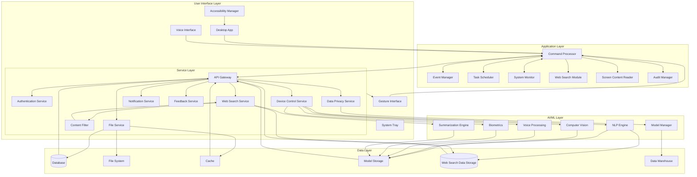

### Command Flow Sequence

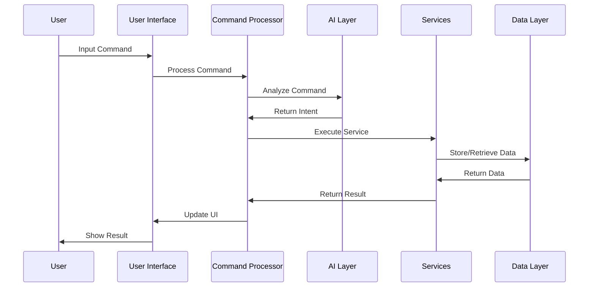

### Core Components Interaction

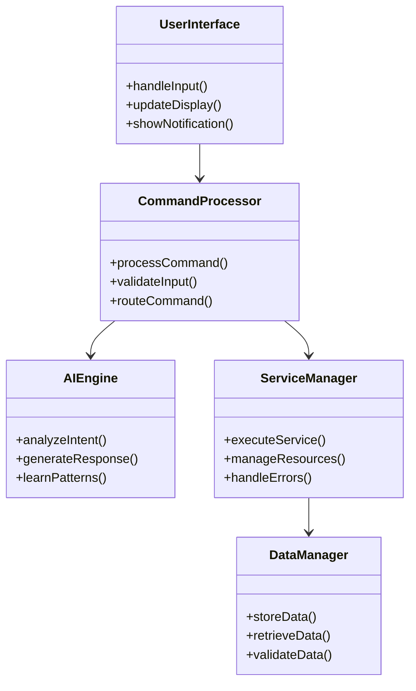

## Detailed System Diagrams

### UML Class Diagrams

a

#### Core System Classes

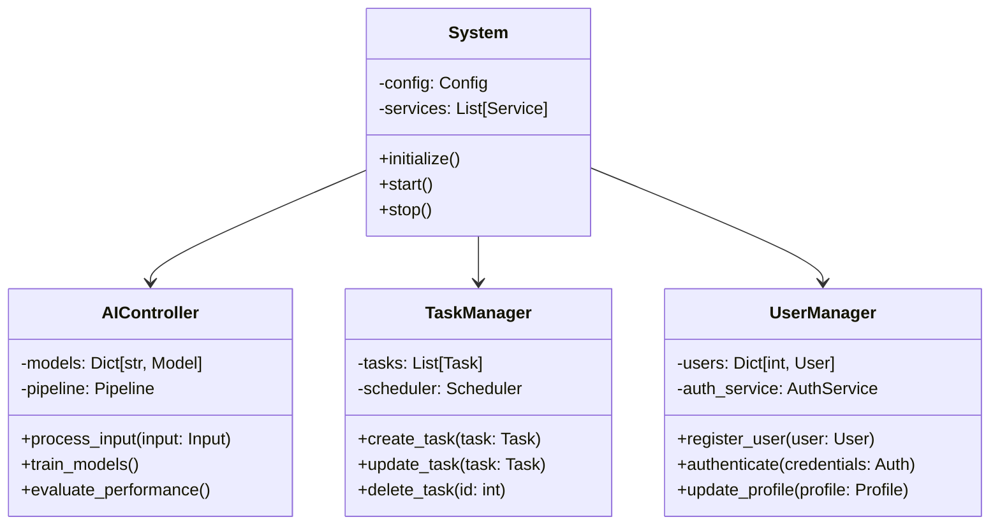

#### Data Models

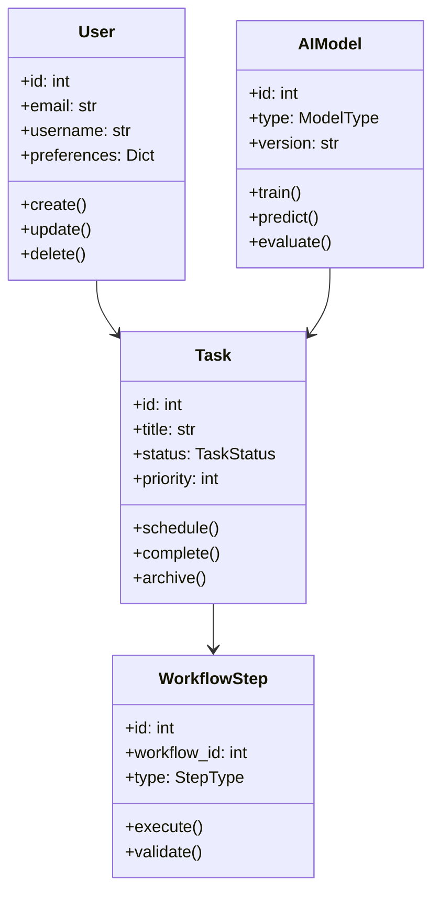

### Component Block Diagrams

#### System Components

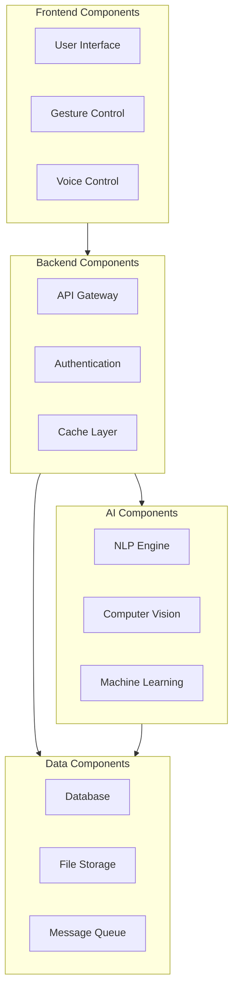

#### Hardware Integration Schematic

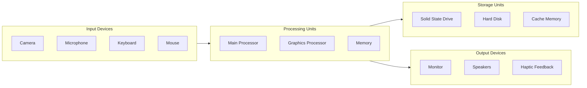

### Sequence Diagrams

#### User Authentication Flow

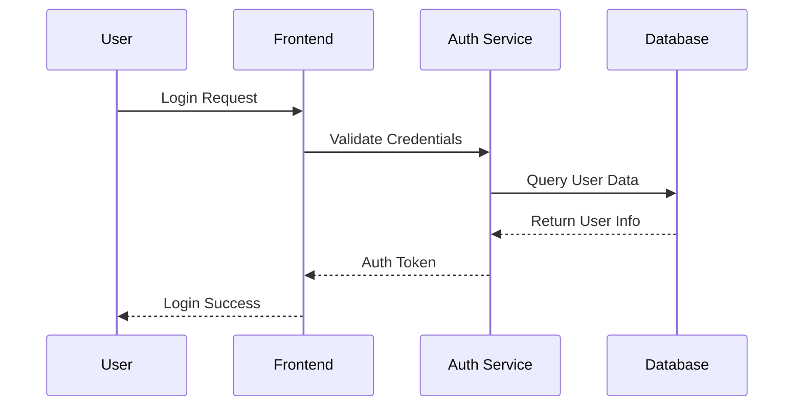

#### Task Creation Flow

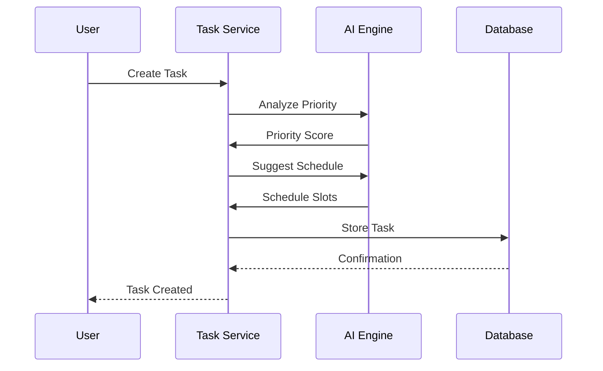

## Technologies & Tools

### Core Technologies

#### Backend Framework

- **Python 3.12+**
    - FastAPI (API framework)
    - SQLAlchemy (ORM)
    - Alembic (Database migrations)
    - Pydantic (Data validation)

#### Database

- **PostgreSQL 14+**
    - Primary database
    - Complex query support
    - JSONB data types
- **Redis**
    - Cache management
    - Real-time data handling
    - Session storage

#### AI/ML Stack

- **Natural Language Processing**
    
    - SpaCy/NLTK (Core NLP)
    - BERT (Text understanding)
    - Custom intent classifiers
    - Multi-language support
- **Computer Vision**
    
    - OpenCV (Image/video processing)
    - MediaPipe (Gesture recognition)
    - Custom CNN models + pretrained models
    - TensorFlow (ML models)

#### Frontend

- **Electron**
    - Cross-platform desktop app
    - Native system integration
- **JavaScript/TypeScript**
    - React (UI framework)
    - WebSocket (Real-time communication)

### Development Tools

#### Version Control

- Git
- GitHub Actions (CI/CD)

#### Development Environment

- VSCode
- Docker containers
- Virtual environments (venv)

#### Testing

- Pytest (Unit testing)
- Coverage.py (Code coverage)
- Postman (API testing)

#### Monitoring & Logging

- Custom logging system
- Performance monitoring
- Error tracking

### Third-Party Integrations

#### APIs & Services

- Google Calendar API
- Outlook API
- Elasticsearch (Search engine)
- WebSocket services

#### Security & Authentication

- JWT authentication
- OAuth2 integration
- Encryption at rest
- SSL/TLS

### Development Operations

#### Database Management

- Automated backups
- Migration scripts
- Data seeding
- Connection pooling

#### Deployment

- Docker containerization
- Environment configuration
- Dependency management
- Automated setup scripts

### System Requirements

#### Minimum Requirements

- Python 3.8+
- PostgreSQL 14+
- Node.js 18+
- 8GB RAM
- 4 CPU cores

#### Recommended

- 16GB RAM
- 8 CPU cores
- SSD storage
- Dedicated GPU (for CV operations)

## Implementation Details

### Core Modules

1.  **Input Processing Module**

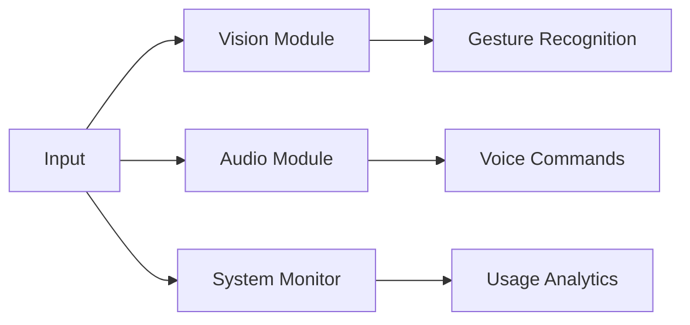

2.  **Task Management Module**

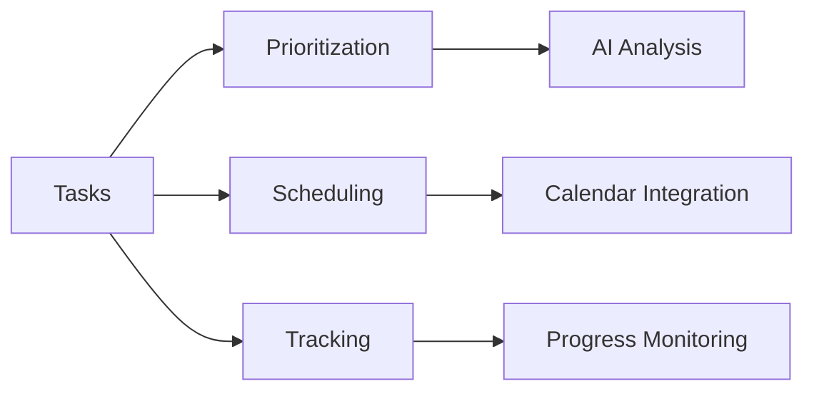

3.  **AI/ML Module**

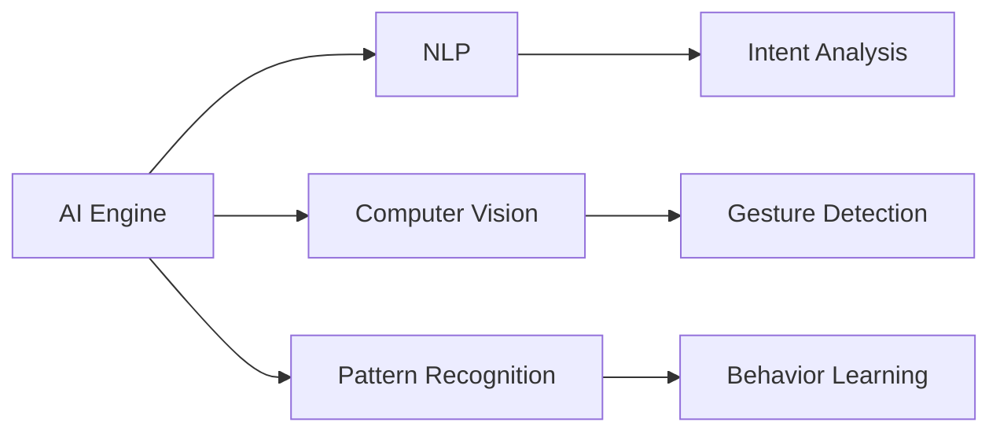

## Getting Started

### Prerequisites

- Python 3.12+
- PostgreSQL 14+
- Node.js 18+
- Docker

### Installation

```bash
# Clone repository
git clone https://github.com/yourusername/aiwa.git

# Install dependencies
pip install -r requirements.txt

# Setup database
python scripts/setup_db.py

# Run application
python src/main.py
```

### Configuration

1.  Copy `.env.example` to `.env`
2.  Update database credentials
3.  Configure AI model paths
4.  Set API keys for integrations

### Running Tests

```bash
python -m pytest tests/
```

## AI/ML Architecture

### 1. Natural Language Processing Pipeline

```mermaid
graph TD
    subgraph NLP["NLP Pipeline"]
        I[Input Text] --> T[Tokenization]
        T --> L[Language Detection]
        L --> P[POS Tagging]
        P --> N[NER]
        N --> S[Semantic Analysis]
        S --> IE[Intent Extraction]
        IE --> C[Command Generation]
    end
    
    subgraph Models["AI Models"]
        M1[SpaCy Model]
        M2[BERT Model]
        M3[Custom Intent Classifier]
    end
    
    subgraph Integration["Task Integration"]
        TM[Task Manager]
        CM[Calendar Manager]
        SM[Search Manager]
    end
    
    IE --> M3
    M3 --> TM
    M3 --> CM
    M3 --> SM


```

### 2. Computer Vision System

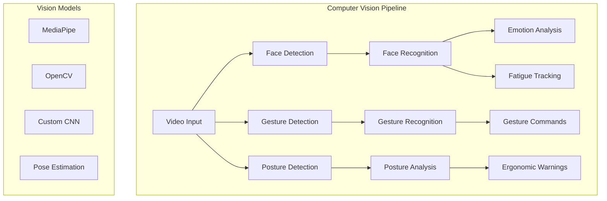

### 3. Task Management AI System

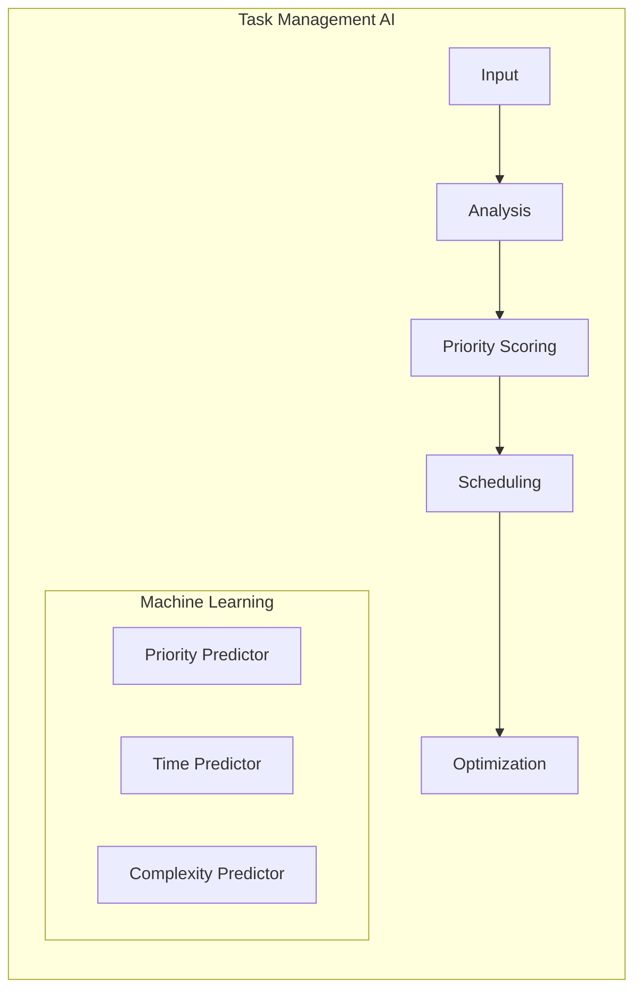

## AI Model Details

### 1. Language Processing Models

#### Core NLP Engine

- **Model**: Custom BERT-based model
- **Purpose**: Understanding user commands and context
- **Features**:
    - Multi-language support
    - Context awareness
    - Intent classification
    - Entity extraction
    - Sentiment analysis

```python
class NLPEngine:
    def __init__(self):
        self.bert_model = AutoModel.from_pretrained('bert-base-multilingual-cased')
        self.intent_classifier = IntentClassifier()
        self.entity_extractor = EntityExtractor()
    
    def process_command(self, text: str) -> Dict:
        embeddings = self.bert_model.encode(text)
        intent = self.intent_classifier.predict(embeddings)
        entities = self.entity_extractor.extract(text)
        return {
            'intent': intent,
            'entities': entities,
            'context': self.get_context()
        }
```

### 2. Computer Vision Models

#### Gesture Recognition System

- **Model**: MediaPipe + Custom CNN
- **Purpose**: Detecting and interpreting user gestures
- **Features**:
    - Hand gesture recognition
    - Facial expression analysis
    - Posture tracking
    - Eye tracking for fatigue detection

```python
class VisionSystem:
    def __init__(self):
        self.mediapipe_hands = mp.solutions.hands
        self.gesture_classifier = GestureClassifier()
        self.posture_analyzer = PostureAnalyzer()
        
    def process_frame(self, frame: np.ndarray) -> Dict:
        hand_data = self.detect_hands(frame)
        gestures = self.classify_gestures(hand_data)
        posture = self.analyze_posture(frame)
        return {
            'gestures': gestures,
            'posture': posture,
            'alerts': self.generate_alerts()
        }
```

### 3. Task Management AI

#### Smart Task Scheduler

- **Model**: Custom ML Pipeline
- **Purpose**: Intelligent task prioritization and scheduling
- **Features**:
    - Priority prediction
    - Time estimation
    - Resource optimization
    - Deadline management

```python
class TaskAI:
    def __init__(self):
        self.priority_model = PriorityPredictor()
        self.time_estimator = TimeEstimator()
        self.scheduler = OptimizedScheduler()
    
    def process_task(self, task: Task) -> ScheduledTask:
        priority = self.priority_model.predict(task)
        time_estimate = self.time_estimator.predict(task)
        schedule = self.scheduler.optimize(
            task, priority, time_estimate
        )
        return schedule
```

### 4. Integration System

#### Web Search and Content Analysis

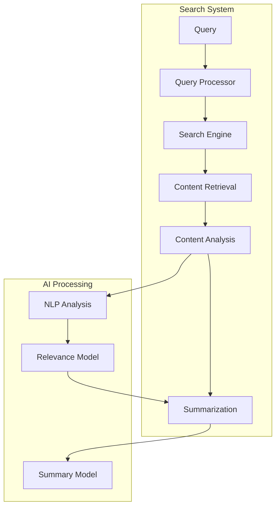

```python
class ContentAnalyzer:
    def __init__(self):
        self.search_engine = WebSearchEngine()
        self.content_processor = ContentProcessor()
        self.summarizer = TextSummarizer()
    
    async def analyze_topic(self, query: str) -> Analysis:
        search_results = await self.search_engine.search(query)
        processed_content = self.content_processor.process(search_results)
        summary = self.summarizer.summarize(processed_content)
        return Analysis(
            query=query,
            results=search_results,
            summary=summary,
            recommendations=self.generate_recommendations()
        )
```

### 5. System Integration

#### Model Interaction Flow

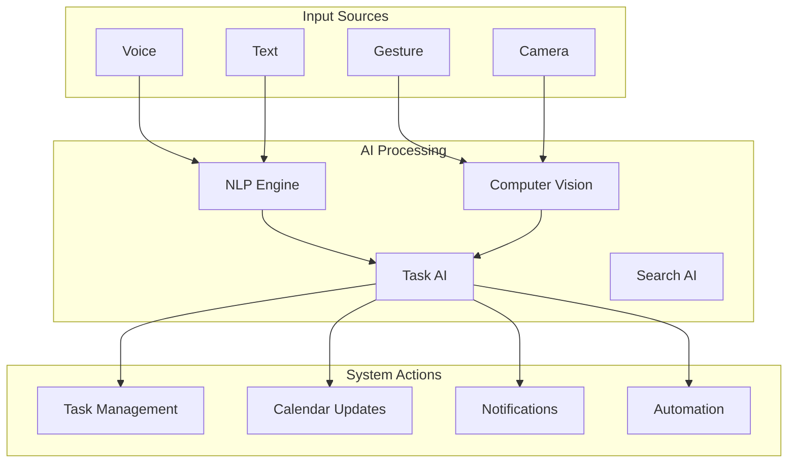

## Model Training and Updates

### Training Pipeline

1.  **Data Collection**
    
    - User interactions
    - Task completion patterns
    - Gesture recordings
    - Voice commands
2.  **Training Process**
    
    ```python
    class ModelTrainer:
        def train_models(self):
            self.train_nlp()
            self.train_vision()
            self.train_task_predictor()
            self.validate_models()
            self.deploy_models()
    ```
    
3.  **Continuous Learning**
    
    - Feedback integration
    - Performance monitoring
    - Model versioning
    - A/B testing

### Performance Metrics

- Command understanding accuracy
- Gesture recognition precision
- Task prediction accuracy
- System response time
- User satisfaction scores

## Security and Privacy

### Model Security

1.  **Data Protection**
    
    - Encryption at rest
    - Secure model storage
    - Access control
2.  **Privacy Measures**
    
    - Data anonymization
    - Local processing when possible
    - Consent management
    - Data retention policies

## Database Architecture

### Database Schema

```mermaid
erDiagram
  User {
    id integer
    email character
    username character
    password_hash character
    status USER-DEFINED
    first_name character
    last_name character
    avatar_url character
    bio character
    timezone character
    locale character
    notification_preferences json
    mfa_enabled boolean
    mfa_secret character
    last_login timestamp
    failed_login_attempts integer
    locked_until timestamp
    created_at timestamp
    updated_at timestamp
    deleted_at timestamp
  }
  ai_models {
    id integer
    name character
    version character
    type character
    storage_path character
    model_metadata json
    status USER-DEFINED
    created_at timestamp
    updated_at timestamp
  }
  alembic_version {
    version_num character
  }
  auth_logs {
    id integer
    user_id integer
    event_type USER-DEFINED
    status USER-DEFINED
    ip_address character
    user_agent character
    device_info json
    details json
    created_at timestamp
  }
  cache_entries {
    id integer
    cache_key character
    cache_value json
    created_at timestamp
    expires_at timestamp
    user_id integer
  }
  data_archives {
    id integer
    request_id integer
    data_type character
    original_id integer
    content json
    more_data json
    created_at timestamp
  }
  data_requests {
    id integer
    user_id integer
    request_type USER-DEFINED
    status USER-DEFINED
    data_types json
    date_range json
    format character
    reason character
    download_url character
    file_size integer
    expiry_date timestamp
    error_message character
    created_at timestamp
    updated_at timestamp
    completed_at timestamp
  }
  device_control_logs {
    id integer
    device_id integer
    user_id integer
    action character
    parameters json
    result json
    status character
    error_message character
    execution_time double
    created_at timestamp
  }
  device_controls {
    id integer
    user_id integer
    device_id character
    device_name character
    device_type USER-DEFINED
    status USER-DEFINED
    manufacturer character
    model character
    firmware_version character
    capabilities json
    configuration json
    last_ping timestamp
    battery_level double
    signal_strength double
    temperature double
    is_active boolean
    auto_connect boolean
    maintenance_mode boolean
    location json
    tags json
    notes character
    created_at timestamp
    updated_at timestamp
  }
  emotional_recognitions {
    id integer
    user_id integer
    emotion character
    confidence_level double
    source_type character
    source_data text
    recognition_metadata json
    timestamp timestamp
  }
  feedback {
    id integer
    user_id integer
    type USER-DEFINED
    title character
    content text
    status USER-DEFINED
    priority USER-DEFINED
    category character
    context json
    add_data json
    tags json
    resolution text
    resolved_by integer
    resolved_at timestamp
    created_at timestamp
    updated_at timestamp
  }
  feedback_comments {
    id integer
    feedback_id integer
    user_id integer
    content text
    is_internal boolean
    created_at timestamp
    updated_at timestamp
  }
  file_logs {
    id integer
    user_id integer
    file_path character
    operation character
    status character
    size integer
    checksum character
    extra_informations json
    error_message character
    created_at timestamp
  }
  health_metrics {
    id integer
    user_id integer
    metric_type character
    value double
    unit character
    health_data json
    created_at timestamp
  }
  integration_logs {
    id integer
    integration_id integer
    endpoint character
    method character
    request_data json
    response_data json
    status_code integer
    status character
    duration integer
    size integer
    error_message character
    stack_trace text
    correlation_id character
    created_at timestamp
  }
  integrations {
    id integer
    name character
    integration_type USER-DEFINED
    status USER-DEFINED
    config json
    credentials json
    headers json
    retry_config json
    rate_limit json
    timeout integer
    health_check_url character
    last_health_check timestamp
    error_count integer
    last_error character
    description character
    version character
    documentation_url character
    created_at timestamp
    updated_at timestamp
  }
  model_metrics {
    id integer
    model_id integer
    metric_name character
    metric_value double
    metric_type character
    dataset_name character
    split_name character
    metric_data json
    timestamp timestamp
  }
  model_usage_logs {
    id integer
    user_id integer
    model_name character
    model_version character
    operation_type character
    input_data json
    output_data json
    execution_time_ms integer
    memory_usage_mb double
    cpu_usage_percent double
    gpu_usage_percent double
    status character
    error_message character
    performance_metrics json
    timestamp timestamp
    batch_id character
    tags json
    cost double
    is_cached boolean
    cache_hit_rate double
  }
  notifications {
    id integer
    user_id integer
    notification_type USER-DEFINED
    priority USER-DEFINED
    title character
    message text
    deep_link character
    channels json
    scheduled_at timestamp
    sent_at timestamp
    is_read boolean
    is_archived boolean
    read_at timestamp
    additional_data json
    icon character
    action_buttons json
    created_at timestamp
    updated_at timestamp
    expires_at timestamp
  }
  password_resets {
    id integer
    user_id integer
    token character
    is_used boolean
    created_at timestamp
    expires_at timestamp
    used_at timestamp
    ip_address character
  }
  permissions {
    id integer
    name character
    description character
    resource character
    action character
  }
  privacy_settings {
    id integer
    user_id integer
    data_collection boolean
    data_sharing boolean
    marketing_communications boolean
    analytics_tracking boolean
    created_at timestamp
    updated_at timestamp
  }
  role_permissions {
    role_id integer
    permission_id integer
    created_at timestamp
  }
  roles {
    id integer
    name character
    description character
    created_at timestamp
    updated_at timestamp
  }
  sessions {
    id integer
    user_id integer
    session_token character
    refresh_token character
    session_type USER-DEFINED
    status USER-DEFINED
    device_id character
    device_info json
    ip_address character
    user_agent character
    location_info json
    mfa_verified boolean
    last_activity timestamp
    last_ip character
    security_events json
    created_at timestamp
    expires_at timestamp
    revoked_at timestamp
  }
  summaries {
    id integer
    content_type character
    content_id integer
    summary text
    key_points json
    language character
    model_version character
    confidence_score double
    extra_info json
    word_count integer
    created_at timestamp
    updated_at timestamp
    last_validated_at timestamp
  }
  system_logs {
    id integer
    level USER-DEFINED
    category USER-DEFINED
    message text
    details json
    source character
    trace_id character
    user_id integer
    stack_trace text
    request_data json
    environment json
    created_at timestamp
    ip_address character
    host character
  }
  tags {
    id integer
    name character
    slug character
    description text
    tag_type USER-DEFINED
    color character
    icon character
    extra_metadata json
    parent_id integer
    order integer
    is_public boolean
    created_by integer
    created_at timestamp
    updated_at timestamp
  }
  task_attachments {
    id integer
    task_id integer
    file_name character
    file_path character
    file_type character
    file_size integer
    uploaded_by integer
    created_at timestamp
    updated_at timestamp
  }
  task_categories {
    id integer
    name character
    description character
    color_code character
    icon character
    parent_id integer
    created_at timestamp
    updated_at timestamp
  }
  task_comments {
    id integer
    task_id integer
    user_id integer
    content text
    parent_id integer
    created_at timestamp
    updated_at timestamp
  }
  task_history {
    id integer
    task_id integer
    user_id integer
    action character
    field character
    old_value character
    new_value character
    created_at timestamp
  }
  tasks {
    id integer
    title character
    description text
    user_id integer
    assignee_id integer
    status USER-DEFINED
    priority USER-DEFINED
    category_id integer
    workflow_id integer
    due_date timestamp
    created_at timestamp
    updated_at timestamp
    completed_at timestamp
    creator_id integer
  }
  user_preferences {
    id integer
    user_id integer
    theme character
    language character
    timezone character
    date_format character
    time_format character
    notifications_enabled boolean
    email_notifications boolean
    push_notifications boolean
    notification_preferences json
    accessibility_settings json
    workflow_preferences json
    dashboard_layout json
    shortcuts json
    data_sharing boolean
    analytics_tracking boolean
    created_at timestamp
    updated_at timestamp
  }
  user_roles {
    id integer
    user_id integer
    role_id integer
    created_at timestamp
    updated_at timestamp
  }
  web_search_queries {
    id integer
    user_id integer
    query_text text
    search_type character
    filters json
    results json
    result_count integer
    execution_time double
    is_cached boolean
    cache_hit boolean
    created_at timestamp
  }
  workflow_steps {
    id integer
    workflow_id integer
    name character
    description text
    step_type USER-DEFINED
    order integer
    config json
    conditions json
    timeout integer
    retry_config json
    is_required boolean
    auto_advance boolean
    can_revert boolean
    created_at timestamp
    updated_at timestamp
  }
  workflow_transitions {
    id integer
    from_step_id integer
    to_step_id integer
    conditions json
    triggers json
    created_at timestamp
  }
  workflows {
    id integer
    name character
    description text
    category character
    status USER-DEFINED
    version character
    settings json
    triggers json
    permissions json
    tags json
    created_by integer
    created_at timestamp
    updated_at timestamp
    published_at timestamp
    archived_at timestamp
  }
  APIKey {
    id integer
    user_id integer
    key character
    description character
    is_active boolean
    created_at timestamp
    expires_at timestamp
  }
  
  BackgroundJob {
    id integer
    job_type character
    payload json
    status USER-DEFINED
    result json
    error_message text
    started_at timestamp
    completed_at timestamp
    created_at timestamp
  }


  ContentFilterRule {
    id integer
    keyword character
    description character
    created_at timestamp
    updated_at timestamp
  }

  DailyHabit {
    id integer
    user_id integer
    habit_name character
    frequency character
    status character
    created_at timestamp
    updated_at timestamp
  }


  Organization {
    id integer
    name character
    user_id integer
    description text
    created_at timestamp
    updated_at timestamp
  }

  projects {
    id integer
    organization_id integer
    name character
    description text
    created_at timestamp
    updated_at timestamp
  }


  security_audit_logs {
    id integer
    timestamp timestamp
    event_type character
    user_id integer
    ip_address character
    user_agent character
    request_path character
    request_method character
    details json
  }

  security_events {
    id integer
    user_id integer
    action character
    timestamp timestamp
    event_type character
    ip_address character
    severity character
    description character
    event_metadata character
  }


  SubscriptionPlan {
    id integer
    name character
    price float
    features json
    created_at timestamp
    updated_at timestamp
  }

  Subscription {
    id integer
    user_id integer
    plan_id integer
    status character
    started_at timestamp
    expires_at timestamp
    created_at timestamp
    updated_at timestamp
  }

  Payment {
    id integer
    subscription_id integer
    amount float
    payment_method character
    payment_date timestamp
    status character
    transaction_id character
  }


  
  User ||--o{ auth_logs : has
  User ||--o{ cache_entries : has
  User ||--o{ data_requests : makes
  User ||--o{ device_controls : owns
  User ||--o{ emotional_recognitions : has
  User ||--o{ feedback : provides
  User ||--o{ file_logs : has
  User ||--o{ health_metrics : tracks
  User ||--o{ notifications : receives
  User ||--o{ password_resets : requests
  User ||--o{ privacy_settings : has
  User ||--o{ sessions : has
  User ||--o{ user_preferences : has
  User ||--o{ user_roles : belongs_to
  User ||--o{ web_search_queries : performs
  User ||--o{ feedback_comments : posts
  User ||--o{ task_comments : posts
  User ||--o{ task_history : creates
  User ||--o{ tasks : creates
  User ||--o{ model_usage_logs : uses
  User ||--o{ APIKey : has
  User ||--o{ BackgroundJob : creates
  User ||--o{ DailyHabit : tracks
  User ||--o{ Organization : belongs_to
  User ||--o{ projects : manages
  User ||--o{ security_audit_logs : logs
  User ||--o{ security_events : logs
  User ||--o{ Subscription : subscribes_to
  User ||--o{ Payment : makes

       

  roles ||--o{ user_roles : includes
  roles ||--o{ role_permissions : has
  permissions ||--o{ role_permissions : included_in
  
  tasks ||--o{ task_attachments : has
  tasks ||--o{ task_comments : has
  tasks ||--o{ task_history : tracks
  tasks }o--|| task_categories : belongs_to
  tasks ||--o| User : assigned_to

  workflows ||--o{ workflow_steps : contains
  workflow_steps ||--o{ workflow_transitions : connects

  workflows ||--|| tags : uses_tags
  
  ai_models ||--o{ model_metrics : measures
  ai_models ||--o{ model_usage_logs : logs
  ai_models ||--|| tasks : supports

  integrations ||--o{ integration_logs : logs
  integrations ||--|| tasks : relates_to
  integrations ||--|| notifications : triggers

  feedback ||--o{ feedback_comments : includes
  feedback ||--o| User : resolved_by
  feedback ||--|| tags : categorized_by

  tags ||--o{ task_categories : categorizes
  tags ||--o{ tasks : tags
  tags ||--|| feedback : tags
  tags ||--|| ai_models : labels
  tags ||--|| workflows : labels
  
  device_controls ||--o{ device_control_logs : logs
  device_controls ||--|| User : linked_to
  device_controls ||--|| tags : tagged_with

  notifications ||--|| tasks : notifies_about
  notifications ||--|| workflows : informs
  notifications ||--|| feedback : alerts_on

  privacy_settings ||--|| User : belongs_to
  user_preferences ||--|| User : belongs_to

  data_archives ||--o{ data_requests : generated_by
  data_archives ||--o{ data_requests : linked_to
  data_archives ||--o{ User : accessed_by

  summaries ||--o{ tasks : summarizes
  summaries ||--o{ ai_models : generated_by
  summaries ||--o{ workflows : relates_to

  system_logs ||--o{ User : created_by
  system_logs ||--o{ tasks : logs_for
  system_logs ||--o{ workflows : logs_for
  system_logs ||--o{ integrations : logs_for
  system_logs ||--o{ model_usage_logs : logs_for

  tasks ||--|| workflows : part_of

  Organization ||--o{ projects : manages
  SubscriptionPlan ||--o{ Subscription : has
  Subscription ||--o{ Payment : has


  ai_models ||--o{ model_usage_logs : logs

  summaries ||--o| User : created_by

  ContentFilterRule ||--o{ tasks : filters
  ContentFilterRule ||--o{ feedback : filters
  ContentFilterRule ||--|| User : managed_by
  
  BackgroundJob ||--|| workflows : triggered_by
  BackgroundJob ||--|| integrations : executed_by
  
  User ||--|| SubscriptionPlan : subscribes_to
  User ||--o{ system_logs : creates
  User ||--o{ tags : creates
  
  security_audit_logs ||--|| sessions : audits
  security_events ||--|| sessions : monitors
  security_audit_logs ||--|| integrations : monitors
  
  tasks ||--|| Organization : belongs_to
  tasks ||--|| projects : belongs_to
  
  Organization ||--|| integrations : uses
  Organization ||--|| SubscriptionPlan : subscribes_to
  
  projects ||--|| integrations : uses
  projects ||--|| workflows : implements
  
  integrations ||--|| Organization : configured_for
  integrations ||--|| SubscriptionPlan : available_in
  
  device_controls ||--|| Organization : belongs_to
  device_controls ||--|| projects : assigned_to
  
  workflows ||--|| Organization : belongs_to
  workflows ||--|| projects : belongs_to
  
  health_metrics ||--|| Organization : tracks
  model_metrics ||--|| Organization : tracks
  
  SubscriptionPlan ||--|| Organization : available_to
  Subscription ||--|| Organization : belongs_to
  
  cache_entries ||--|| Organization : belongs_to
  data_archives ||--|| Organization : belongs_to
  
  summaries ||--|| Organization : belongs_to
  summaries ||--|| projects : relates_to
  
  notifications ||--|| Organization : scoped_to
  notifications ||--|| projects : relates_to


```

### Database Schema without fields

```mermaid
erDiagram
    User
    ai_models
    alembic_version
    auth_logs
    cache_entries
    data_archives
    data_requests
    device_control_logs
    device_controls
    emotional_recognitions
    feedback
    feedback_comments
    file_logs
    health_metrics
    integration_logs
    integrations
    model_metrics
    model_usage_logs
    notifications
    password_resets
    permissions
    privacy_settings
    role_permissions
    roles
    sessions
    summaries
    system_logs
    tags
    task_attachments
    task_categories
    task_comments
    task_history
    tasks
    user_preferences
    user_roles
    web_search_queries
    workflow_steps
    workflow_transitions
    workflows
    APIKey
    BackgroundJob
    ContentFilterRule
    DailyHabit
    Organization
    projects
    security_audit_logs
    security_events
    SubscriptionPlan
    Subscription
    Payment

    User ||--o{ auth_logs : has
    User ||--o{ cache_entries : has
    User ||--o{ data_requests : makes
    User ||--o{ device_controls : owns
    User ||--o{ emotional_recognitions : has
    User ||--o{ feedback : provides
    User ||--o{ file_logs : has
    User ||--o{ health_metrics : tracks
    User ||--o{ notifications : receives
    User ||--o{ password_resets : requests
    User ||--o{ privacy_settings : has
    User ||--o{ sessions : has
    User ||--o{ user_preferences : has
    User ||--o{ user_roles : belongs_to
    User ||--o{ web_search_queries : performs
    User ||--o{ feedback_comments : posts
    User ||--o{ task_comments : posts
    User ||--o{ task_history : creates
    User ||--o{ tasks : creates
    User ||--o{ model_usage_logs : uses
    User ||--o{ APIKey : has
    User ||--o{ BackgroundJob : creates
    User ||--o{ DailyHabit : tracks
    User ||--o{ Organization : belongs_to
    User ||--o{ projects : manages
    User ||--o{ security_audit_logs : logs
    User ||--o{ security_events : logs
    User ||--o{ Subscription : subscribes_to
    User ||--o{ Payment : makes

    roles ||--o{ user_roles : includes
    roles ||--o{ role_permissions : has
    permissions ||--o{ role_permissions : included_in
    
    tasks ||--o{ task_attachments : has
    tasks ||--o{ task_comments : has
    tasks ||--o{ task_history : tracks
    tasks }o--|| task_categories : belongs_to
    tasks ||--o| User : assigned_to

    workflows ||--o{ workflow_steps : contains
    workflow_steps ||--o{ workflow_transitions : connects

    workflows ||--|| tags : uses_tags
    
    ai_models ||--o{ model_metrics : measures
    ai_models ||--o{ model_usage_logs : logs
    ai_models ||--|| tasks : supports

    integrations ||--o{ integration_logs : logs
    integrations ||--|| tasks : relates_to
    integrations ||--|| notifications : triggers

    feedback ||--o{ feedback_comments : includes
    feedback ||--o| User : resolved_by
    feedback ||--|| tags : categorized_by

    tags ||--o{ task_categories : categorizes
    tags ||--o{ tasks : tags
    tags ||--|| feedback : tags
    tags ||--|| ai_models : labels
    tags ||--|| workflows : labels
    
    device_controls ||--o{ device_control_logs : logs
    device_controls ||--|| User : linked_to
    device_controls ||--|| tags : tagged_with

    notifications ||--|| tasks : notifies_about
    notifications ||--|| workflows : informs
    notifications ||--|| feedback : alerts_on

    privacy_settings ||--|| User : belongs_to
    user_preferences ||--|| User : belongs_to

    data_archives ||--o{ data_requests : generated_by
    data_archives ||--o{ data_requests : linked_to
    data_archives ||--o{ User : accessed_by

    summaries ||--o{ tasks : summarizes
    summaries ||--o{ ai_models : generated_by
    summaries ||--o{ workflows : relates_to

    system_logs ||--o{ User : created_by
    system_logs ||--o{ tasks : logs_for
    system_logs ||--o{ workflows : logs_for
    system_logs ||--o{ integrations : logs_for
    system_logs ||--o{ model_usage_logs : logs_for

    tasks ||--|| workflows : part_of

    Organization ||--o{ projects : manages
    SubscriptionPlan ||--o{ Subscription : has
    Subscription ||--o{ Payment : has

    ai_models ||--o{ model_usage_logs : logs

    summaries ||--o| User : created_by

    ContentFilterRule ||--o{ tasks : filters
    ContentFilterRule ||--o{ feedback : filters
    ContentFilterRule ||--|| User : managed_by
    
    BackgroundJob ||--|| workflows : triggered_by
    BackgroundJob ||--|| integrations : executed_by
    
    User ||--|| SubscriptionPlan : subscribes_to
    User ||--o{ system_logs : creates
    User ||--o{ tags : creates
    
    security_audit_logs ||--|| sessions : audits
    security_events ||--|| sessions : monitors
    security_audit_logs ||--|| integrations : monitors
    
    tasks ||--|| Organization : belongs_to
    tasks ||--|| projects : belongs_to
    
    Organization ||--|| integrations : uses
    Organization ||--|| SubscriptionPlan : subscribes_to
    
    projects ||--|| integrations : uses
    projects ||--|| workflows : implements
    
    integrations ||--|| Organization : configured_for
    integrations ||--|| SubscriptionPlan : available_in
    
    device_controls ||--|| Organization : belongs_to
    device_controls ||--|| projects : assigned_to
    
    workflows ||--|| Organization : belongs_to
    workflows ||--|| projects : belongs_to
    
    health_metrics ||--|| Organization : tracks
    model_metrics ||--|| Organization : tracks
    
    SubscriptionPlan ||--|| Organization : available_to
    Subscription ||--|| Organization : belongs_to
    
    cache_entries ||--|| Organization : belongs_to
    data_archives ||--|| Organization : belongs_to
    
    summaries ||--|| Organization : belongs_to
    summaries ||--|| projects : relates_to
    
    notifications ||--|| Organization : scoped_to
    notifications ||--|| projects : relates_to


```