# AI Workspace Assistant (AIWA)
> An intelligent AI-powered workspace automation platform

## Table of Contents
- [Problem Overview](#problem-overview)
- [Motivations](#motivations)
- [Project Goals](#project-goals)
- [System Architecture](#system-architecture)
- [Technologies & Tools](#technologies--tools)
- [Implementation Details](#implementation-details)
- [Getting Started](#getting-started)
- [AI/ML Architecture](#ai-ml-architecture)
- [AI Model Details](#ai-model-details)
- [Database Architecture](#database-architecture)

## Problem Overview

In today's digital workspace environment, professionals face several critical challenges:

1. **Information Overload**
   - Managing multiple applications and data sources
   - Difficulty in organizing and finding relevant information
   - Constant context switching between tools

2. **Productivity Barriers**
   - Manual handling of repetitive tasks
   - Inefficient time and calendar management
   - Lack of intelligent task prioritization

3. **Workspace Management**
   - Disconnected tools and workflows
   - Limited automation capabilities
   - Absence of intelligent assistance

## Motivations

### Primary Motivations
1. **Enhance Productivity**
   - Reduce time spent on routine tasks
   - Streamline workflow management
   - Automate repetitive processes

2. **Improve User Experience**
   - Provide intuitive interfaces
   - Reduce cognitive load
   - Enable natural interactions

3. **Leverage AI Technology**
   - Implement intelligent automation
   - Enable predictive assistance
   - Utilize pattern recognition

## Project Goals

### Core Objectives
1. **Intelligent Automation**
   - Develop AI-powered workflow automation
   - Create smart task management system
   - Implement predictive scheduling

2. **Seamless Integration**
   - Connect with existing tools and services
   - Provide unified workspace experience
   - Enable cross-platform compatibility

3. **Enhanced Productivity**
   - Reduce manual task handling
   - Optimize time management
   - Improve focus and efficiency

## System Architecture

### High-Level Architecture
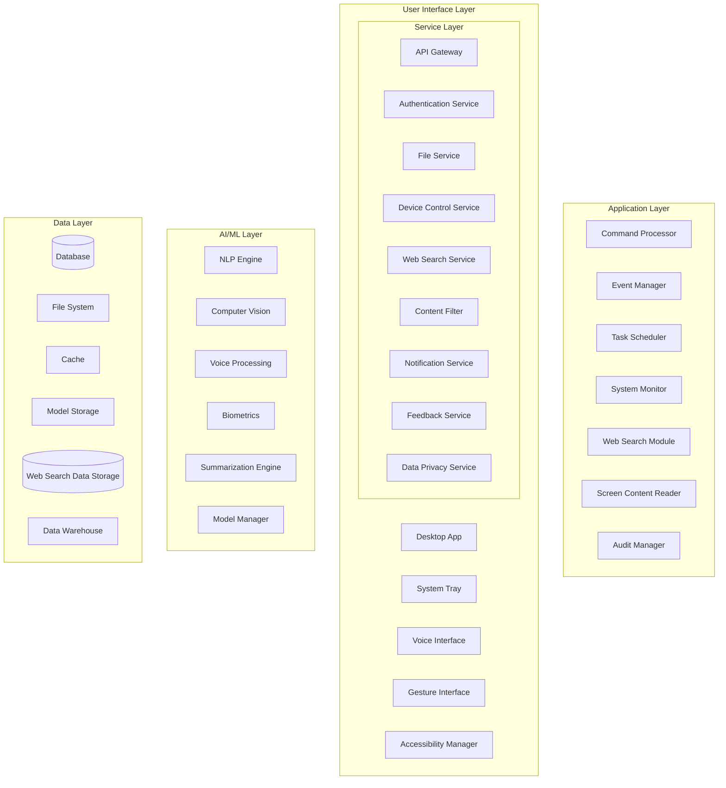

### Command Flow Sequence
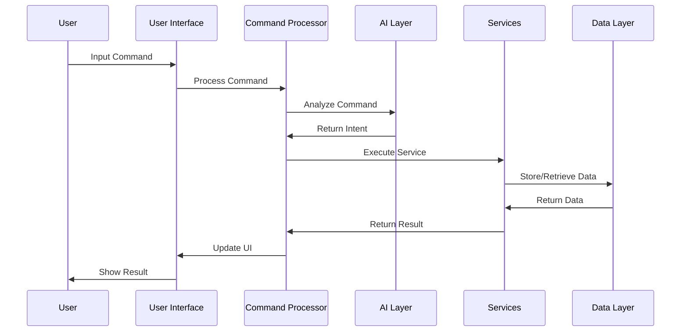

### Core Components Interaction
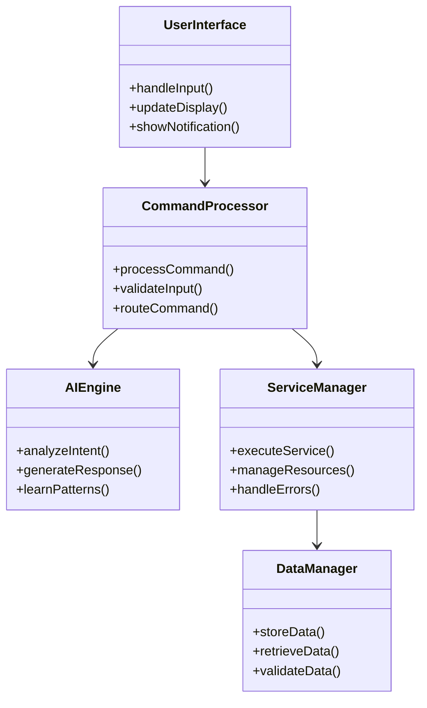

## Detailed System Diagrams

### UML Class Diagrams

#### Core System Classes
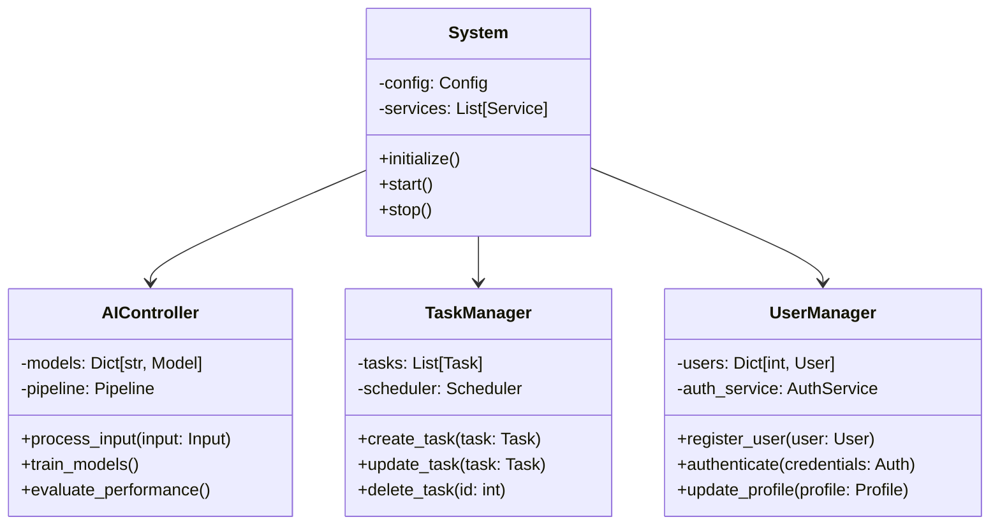

#### Data Models
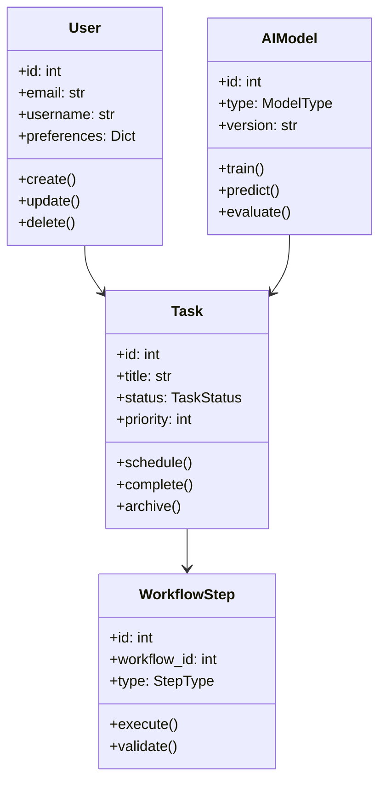

### Component Block Diagrams

#### System Components
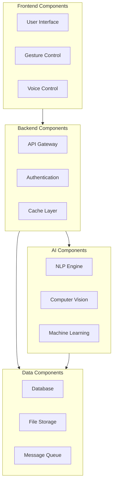

#### Hardware Integration Schematic
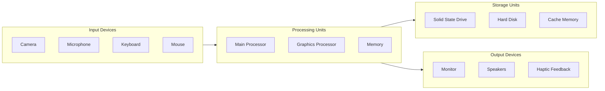

### Sequence Diagrams

#### User Authentication Flow
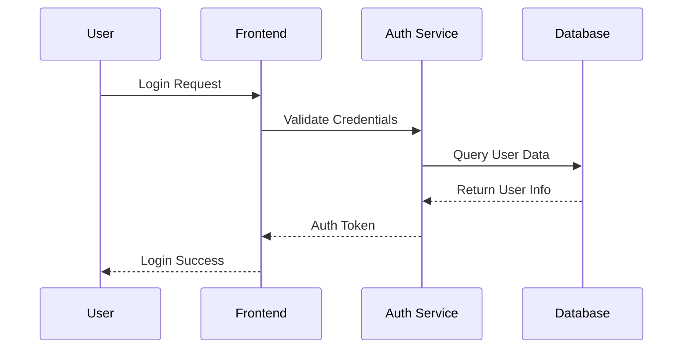

#### Task Creation Flow
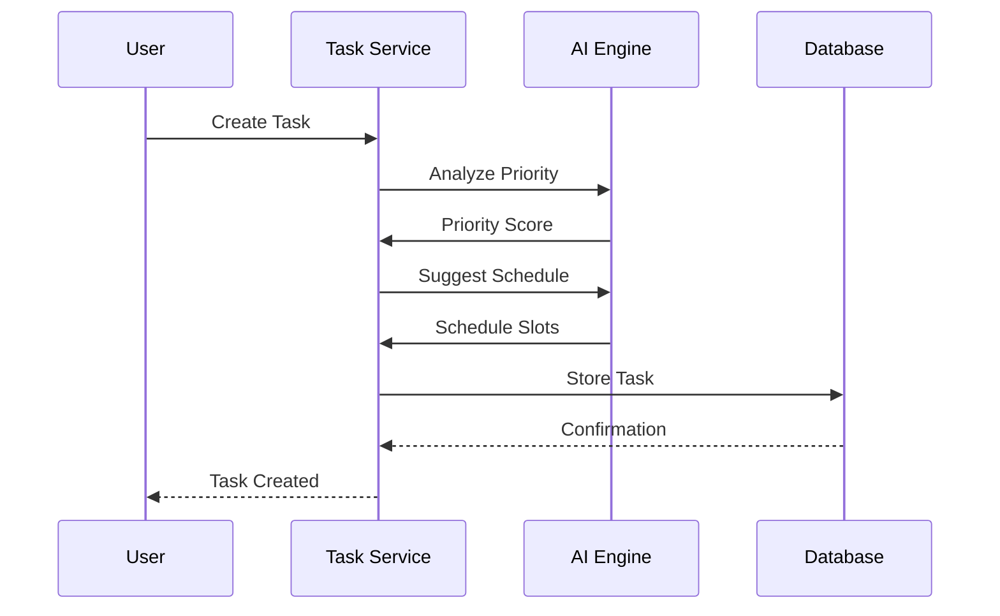

## Technologies & Tools

### Core Technologies

#### Backend Framework
- **Python 3.12+**
  - FastAPI (API framework)
  - SQLAlchemy (ORM)
  - Alembic (Database migrations)
  - Pydantic (Data validation)

#### Database
- **PostgreSQL 14+**
  - Primary database
  - Complex query support
  - JSONB data types
- **Redis**
  - Cache management
  - Real-time data handling
  - Session storage

#### AI/ML Stack
- **Natural Language Processing**
  - SpaCy/NLTK (Core NLP)
  - BERT (Text understanding)
  - Custom intent classifiers
  - Multi-language support

- **Computer Vision**
  - OpenCV (Image/video processing)
  - MediaPipe (Gesture recognition)
  - Custom CNN models
  - TensorFlow/PyTorch (ML models)

#### Frontend
- **Electron**
  - Cross-platform desktop app
  - Native system integration
- **JavaScript/TypeScript**
  - React (UI framework)
  - WebSocket (Real-time communication)

### Development Tools

#### Version Control
- Git
- GitHub Actions (CI/CD)

#### Development Environment
- VSCode/PyCharm
- Docker containers
- Virtual environments (venv)

#### Testing
- Pytest (Unit testing)
- Coverage.py (Code coverage)
- Postman (API testing)

#### Monitoring & Logging
- Custom logging system
- Performance monitoring
- Error tracking

### Third-Party Integrations

#### APIs & Services
- Google Calendar API
- Outlook API
- Elasticsearch (Search engine)
- WebSocket services

#### Security & Authentication
- JWT authentication
- OAuth2 integration
- Encryption at rest
- SSL/TLS

### Development Operations

#### Database Management
- Automated backups
- Migration scripts
- Data seeding
- Connection pooling

#### Deployment
- Docker containerization
- Environment configuration
- Dependency management
- Automated setup scripts

### System Requirements

#### Minimum Requirements
- Python 3.12+
- PostgreSQL 14+
- Node.js 18+
- 8GB RAM
- 4 CPU cores

#### Recommended
- 16GB RAM
- 8 CPU cores
- SSD storage
- Dedicated GPU (for CV operations)

### Development Scripts
- `setup_dev.py`: Development environment setup
- `db_setup.py`: Database initialization
- `seed_data.py`: Initial data population
- `verify_db_connection.py`: Database connection testing
- `generate_erd.py`: Database diagram generation

## Implementation Details

### Core Modules

1. **Input Processing Module**
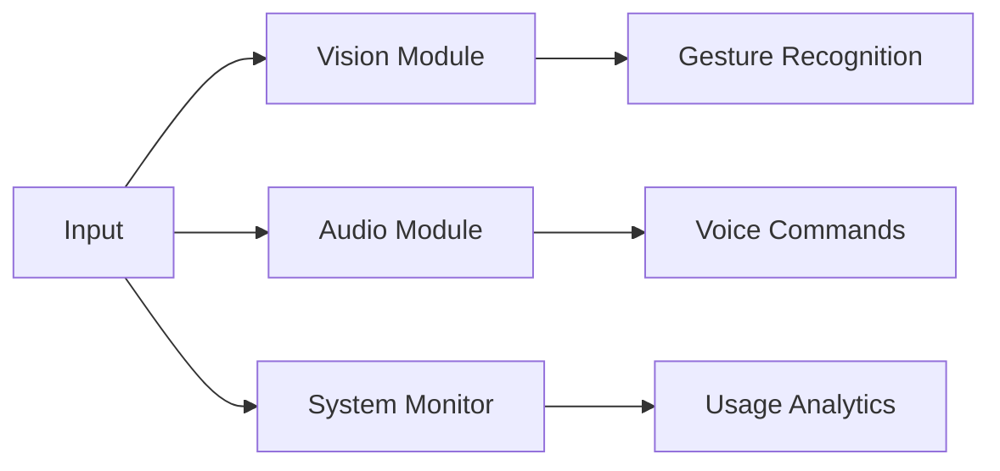

2. **Task Management Module**
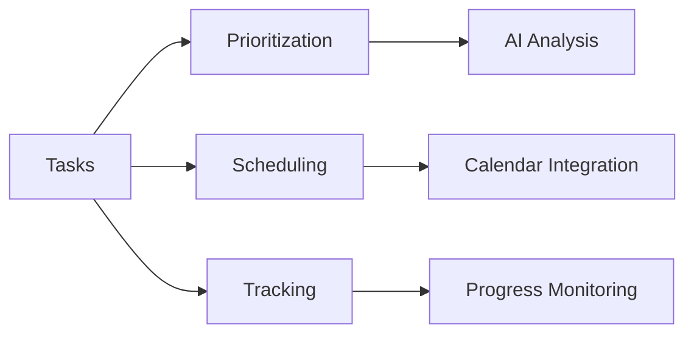

3. **AI/ML Module**
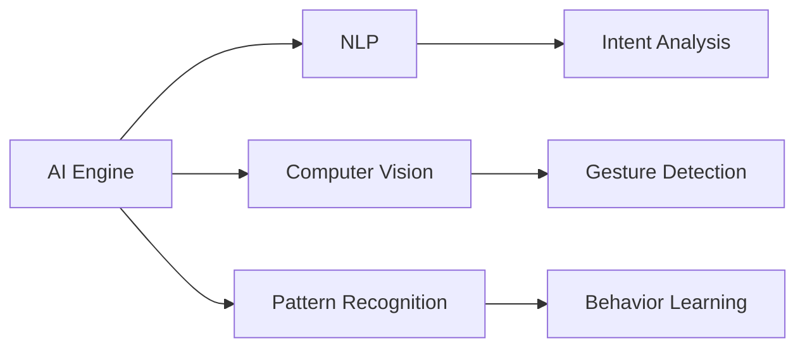

## Getting Started

### Prerequisites
- Python 3.12+
- PostgreSQL 14+
- Node.js 18+
- Docker

### Installation
```bash
# Clone repository
git clone https://github.com/yourusername/aiwa.git

# Install dependencies
pip install -r requirements.txt

# Setup database
python scripts/setup_db.py

# Run application
python src/main.py
```

### Configuration
1. Copy `.env.example` to `.env`
2. Update database credentials
3. Configure AI model paths
4. Set API keys for integrations

### Running Tests
```bash
python -m pytest tests/
```

## AI/ML Architecture

### 1. Natural Language Processing Pipeline
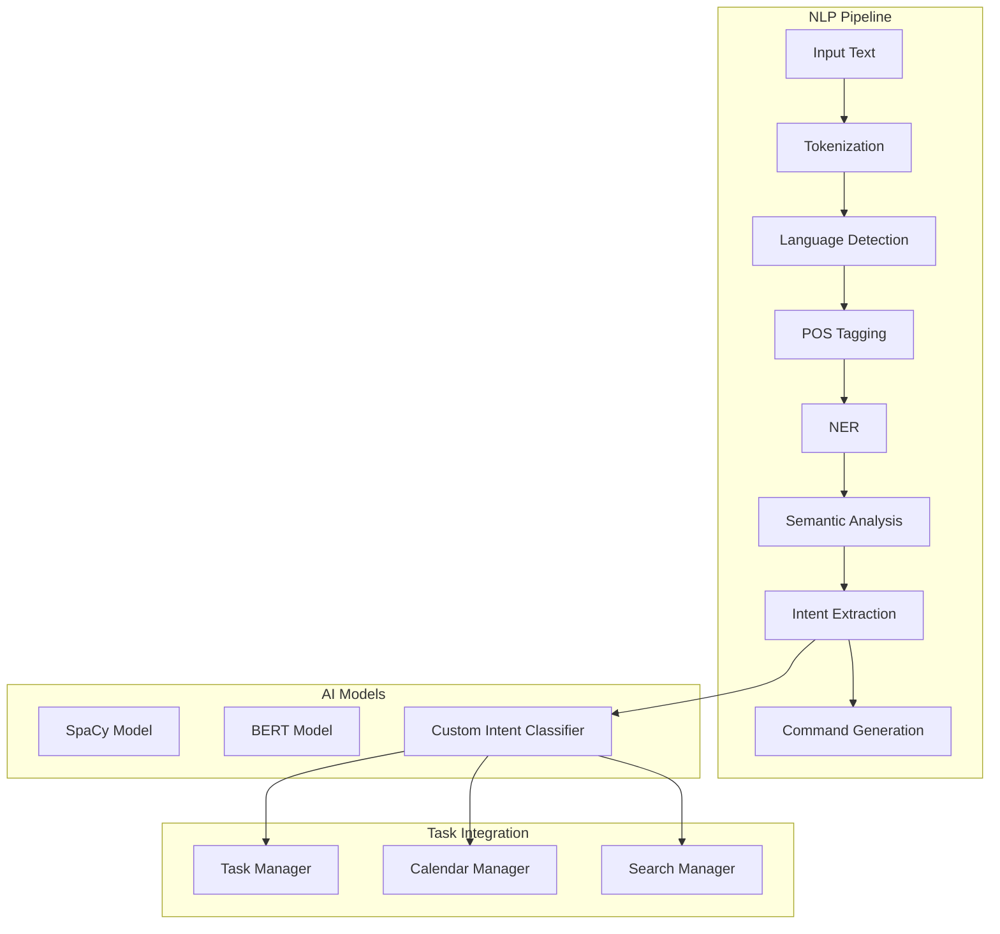

### 2. Computer Vision System
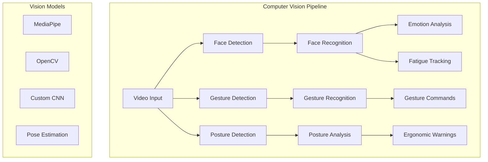

### 3. Task Management AI System
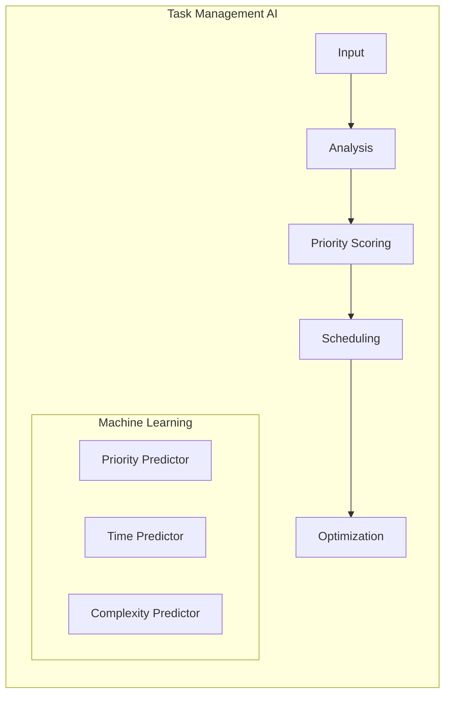

## AI Model Details

### 1. Language Processing Models

#### Core NLP Engine
- **Model**: Custom BERT-based model
- **Purpose**: Understanding user commands and context
- **Features**:
  - Multi-language support
  - Context awareness
  - Intent classification
  - Entity extraction
  - Sentiment analysis

```python
class NLPEngine:
    def __init__(self):
        self.bert_model = AutoModel.from_pretrained('bert-base-multilingual-cased')
        self.intent_classifier = IntentClassifier()
        self.entity_extractor = EntityExtractor()
    
    def process_command(self, text: str) -> Dict:
        embeddings = self.bert_model.encode(text)
        intent = self.intent_classifier.predict(embeddings)
        entities = self.entity_extractor.extract(text)
        return {
            'intent': intent,
            'entities': entities,
            'context': self.get_context()
        }
```

### 2. Computer Vision Models

#### Gesture Recognition System
- **Model**: MediaPipe + Custom CNN
- **Purpose**: Detecting and interpreting user gestures
- **Features**:
  - Hand gesture recognition
  - Facial expression analysis
  - Posture tracking
  - Eye tracking for fatigue detection

```python
class VisionSystem:
    def __init__(self):
        self.mediapipe_hands = mp.solutions.hands
        self.gesture_classifier = GestureClassifier()
        self.posture_analyzer = PostureAnalyzer()
        
    def process_frame(self, frame: np.ndarray) -> Dict:
        hand_data = self.detect_hands(frame)
        gestures = self.classify_gestures(hand_data)
        posture = self.analyze_posture(frame)
        return {
            'gestures': gestures,
            'posture': posture,
            'alerts': self.generate_alerts()
        }
```

### 3. Task Management AI

#### Smart Task Scheduler
- **Model**: Custom ML Pipeline
- **Purpose**: Intelligent task prioritization and scheduling
- **Features**:
  - Priority prediction
  - Time estimation
  - Resource optimization
  - Deadline management

```python
class TaskAI:
    def __init__(self):
        self.priority_model = PriorityPredictor()
        self.time_estimator = TimeEstimator()
        self.scheduler = OptimizedScheduler()
    
    def process_task(self, task: Task) -> ScheduledTask:
        priority = self.priority_model.predict(task)
        time_estimate = self.time_estimator.predict(task)
        schedule = self.scheduler.optimize(
            task, priority, time_estimate
        )
        return schedule
```

### 4. Integration System

#### Web Search and Content Analysis
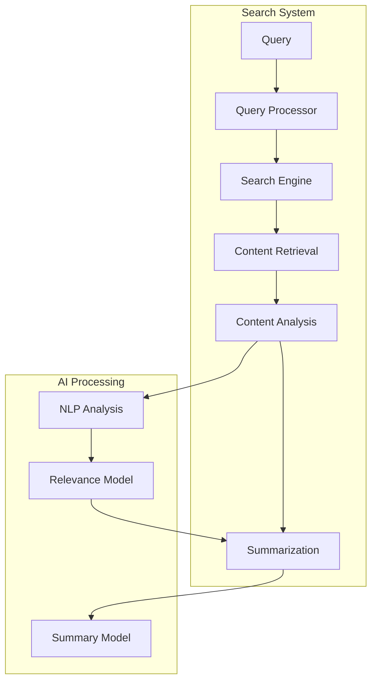

```python
class ContentAnalyzer:
    def __init__(self):
        self.search_engine = WebSearchEngine()
        self.content_processor = ContentProcessor()
        self.summarizer = TextSummarizer()
    
    async def analyze_topic(self, query: str) -> Analysis:
        search_results = await self.search_engine.search(query)
        processed_content = self.content_processor.process(search_results)
        summary = self.summarizer.summarize(processed_content)
        return Analysis(
            query=query,
            results=search_results,
            summary=summary,
            recommendations=self.generate_recommendations()
        )
```

### 5. System Integration

#### Model Interaction Flow
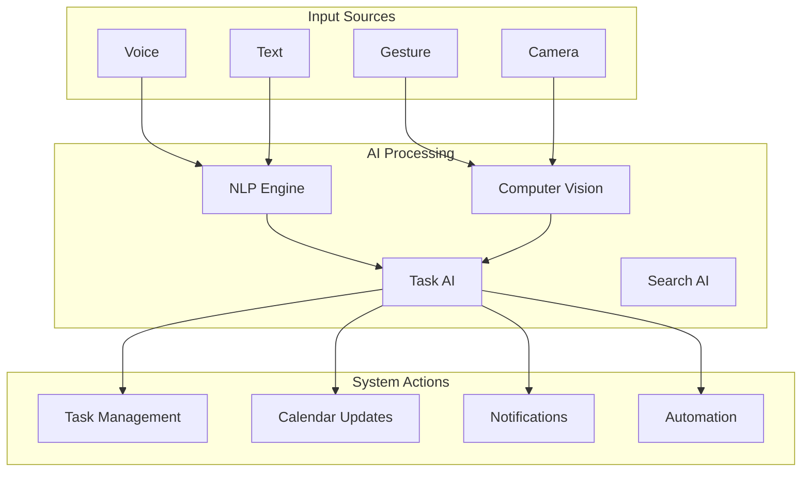

## Model Training and Updates

### Training Pipeline
1. **Data Collection**
   - User interactions
   - Task completion patterns
   - Gesture recordings
   - Voice commands

2. **Training Process**
   ```python
   class ModelTrainer:
       def train_models(self):
           self.train_nlp()
           self.train_vision()
           self.train_task_predictor()
           self.validate_models()
           self.deploy_models()
   ```

3. **Continuous Learning**
   - Feedback integration
   - Performance monitoring
   - Model versioning
   - A/B testing

### Performance Metrics
- Command understanding accuracy
- Gesture recognition precision
- Task prediction accuracy
- System response time
- User satisfaction scores

## Security and Privacy

### Model Security
1. **Data Protection**
   - Encryption at rest
   - Secure model storage
   - Access control

2. **Privacy Measures**
   - Data anonymization
   - Local processing when possible
   - Consent management
   - Data retention policies

## Database Architecture

### Database Schema
```mermaid
erDiagram
    User ||--o{ Task : creates
    User ||--o{ Session : has
    User ||--o{ UserPreference : has
    User }|--|| Role : has
    Role ||--o{ Permission : contains
    
    User {# AI Workspace Assistant (AIWA)
        int id PK
        string username
        string email
        string password_hash
        string full_name
        boolean is_active
        datetime created_at
        datetime updated_at
    }
    
    Task {
        int id PK
        int user_id FK
        string title
        text description
        enum status
        enum priority
        datetime due_date
        datetime created_at
        datetime completed_at
    }
    
    Session {
        int id PK
        int user_id FK
        string token
        datetime expires_at
        string device_info
        datetime created_at
    }
    
    UserPreference {
        int id PK
        int user_id FK
        json settings
        string theme
        string language
        datetime updated_at
    }
    
    Role {
        int id PK
        string name
        string description
        datetime created_at
    }
    
    Permission {
        int id PK
        string name
        string description
        string resource
        string action
    }
```

### Database Tables Overview

1. **Core Tables**
   - Users: User account information
   - Tasks: User tasks and activities
   - Sessions: Authentication sessions
   - UserPreferences: User settings and preferences

2. **Security Tables**
   - Roles: User roles (admin, user, etc.)
   - Permissions: Access control definitions
   - RolePermissions: Role-permission mappings

3. **AI/ML Related Tables**
   - ModelMetrics: Model performance tracking
   - TrainingData: Training dataset management
   - Predictions: AI prediction logs

4. **System Tables**
   - SystemLogs: Application logging
   - AuditTrail: Security audit logging
   - BackupLogs: Database backup tracking